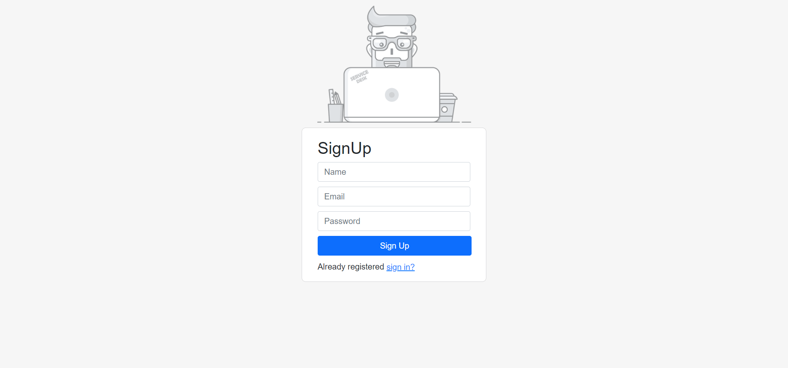
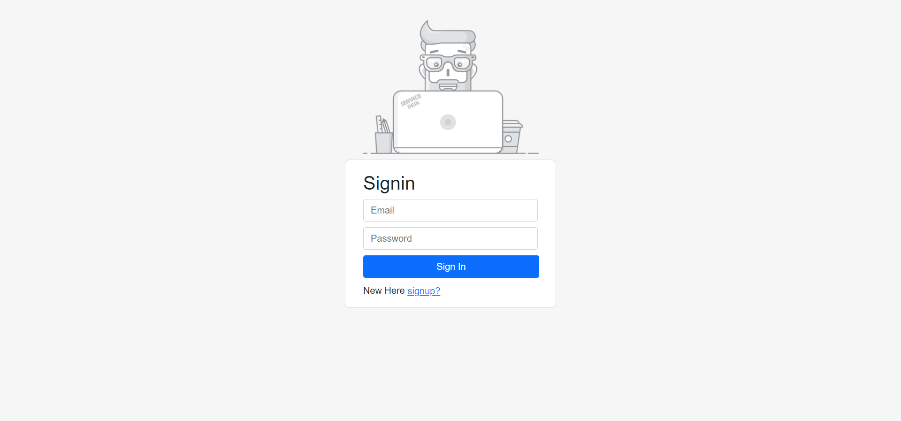

# Login-React
Custom signin ,Signup page in React JS and bootstrap CSS!

## Signup

## Signin

## How to test/run locally
1. Copy/clone the repo
2. Install all dependencies by `npm i`
3. Run the app by `npm start`

